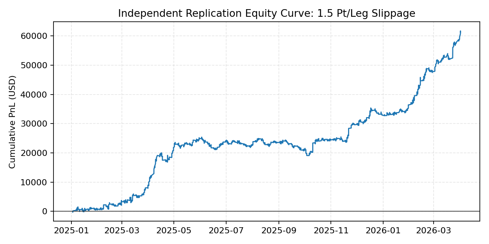
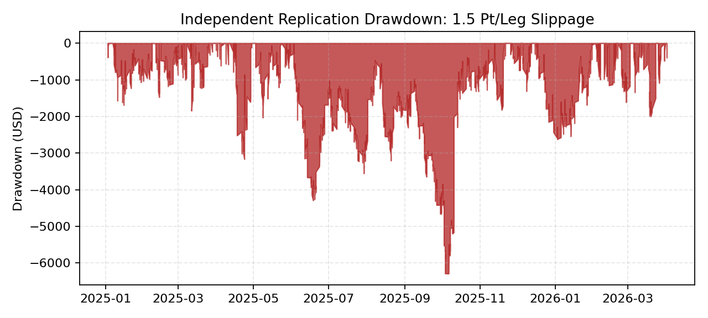
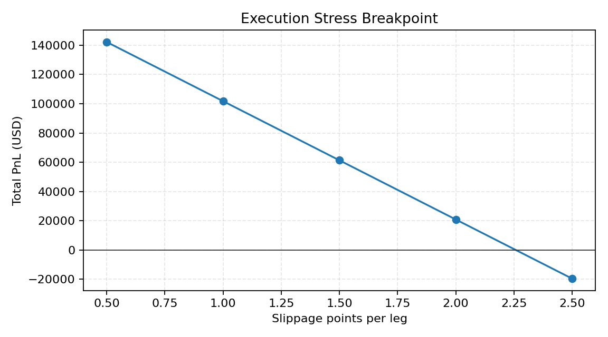

# NQ Futures ML Risk Audit

[](https://github.com/bsmensah-ctrl/nq-futures-ml-risk-audit/actions/workflows/ci.yml)

Independent replication and overfitting audit for a machine-learning-gated NQ futures research strategy.

This repository is a curated portfolio artifact. It is built to answer the question a skeptical reviewer should ask first:

> Which backtest claims still survive after independent rebuild, leakage checks, clean validation, slippage stress, Monte Carlo, and failure analysis?

## Why This Exists

The original research produced an eye-catching Sharpe-like number. That number was not a finance-style Sharpe ratio; it was a trade-level t-statistic. This repo documents the correction: rebuild the strategy from raw bars, downgrade inflated claims, and keep only the evidence that survives stricter validation.

## Headline Result

The most defensible claim is not "profitable bot." It is:

> Built and independently audited an NQ futures research pipeline using walk-forward replication, clean-eval and purged validation, label-shuffle null tests, slippage stress, block-bootstrap Monte Carlo, and execution failure analysis.

At **1.5 NQ points of slippage per leg**, the independently rebuilt original logic produced:

| Test | Trades | PnL | Win Rate | Profit Factor | Monthly Ann. Sharpe |
|---|---:|---:|---:|---:|---:|
| Replicated original logic | 2,022 | +$61,301 | 66.6% | 1.38 | 2.85 |
| Clean-eval rerun | 1,925 | +$60,511 | 67.1% | 1.39 | 2.91 |
| Purged clean-eval rerun | 1,923 | +$56,145 | 66.4% | 1.36 | 2.87 |
| Label-shuffle null | 0 | $0 | 0.0% | n/a | n/a |

The result is **NQ-specific historical research**, not a live trading system.

## Evidence







## Reviewer Fast Path

If you only have five minutes:

1. Read the [methods summary](docs/METHODS.md).
2. Open the [claim matrix](overfit_audit/claim_matrix.csv).
3. Run `python src/reproduce_metrics.py`.
4. Check the [validation checklist](docs/VALIDATION_CHECKLIST.md).
5. Skim the [audit report](overfit_audit/AUDIT_REPORT.pdf).

## What Survived

- Independent rebuild matched the prior conservative 1.5 pt/leg claim.
- Clean-eval validation remained positive without using the test fold for early stopping.
- Purged clean-eval validation remained positive after removing fold-boundary overlap.
- Label-shuffle null produced zero trades.
- Block-bootstrap samples stayed positive across day, week, and month blocks.
- Old 9+ / 13+ "Sharpe" language was rejected and replaced with monthly annualized metrics.

## What Failed

- Same-bar adverse ordering produced **-$175,264**, making intrabar execution assumptions the largest unresolved risk.
- At **2.5 pt/leg slippage**, PnL turned negative.
- Same-logic cross-instrument checks failed on ES and MGC, so broad futures generalization is not supported.
- The original validation was corrected because it used the test fold for LightGBM early stopping.

## Repository Map

```text
.
├── README.md
├── REPRODUCIBILITY.md
├── report.pdf
├── docs/
│   ├── METHODS.md
│   ├── VALIDATION_CHECKLIST.md
│   └── report.md
├── data/
│   └── README.md
├── overfit_audit/
│   ├── AUDIT_REPORT.pdf
│   ├── AUDIT_REPORT.md
│   ├── claim_matrix.csv
│   ├── audit_manifest.json
│   ├── charts/
│   └── tables/
├── paper_trading_log/
│   ├── paper_trading_log_template.csv
│   └── weekly_review_template.md
├── results/
│   └── packaged fresh validation summaries
└── src/
    ├── reproduce_metrics.py
    └── overfit_replication_audit.py
```

## Reproduce Packaged Metrics

```bash
pip install -r requirements.txt
python src/reproduce_metrics.py
pytest -q
```

The quick reproducer reads only committed CSV artifacts. It does not require raw vendor data.

## Full Raw-Data Audit

Raw futures bars are not committed. To rerun the full audit with your own OHLCV data:

```bash
set NQ_RAW_1M_CSV=C:\path\to\databento_nq_1m.csv
set ES_RAW_1M_CSV=C:\path\to\databento_es_1m.csv
set MGC_RAW_1M_CSV=C:\path\to\databento_mgc_1m.csv
python src\overfit_replication_audit.py
```

The expected CSV columns are `timestamp`, `open`, `high`, `low`, `close`, and `volume`.

## Read First

- [Technical report](report.pdf)
- [Overfitting audit report](overfit_audit/AUDIT_REPORT.pdf)
- [Claim matrix](overfit_audit/claim_matrix.csv)
- [Methods](docs/METHODS.md)
- [Validation checklist](docs/VALIDATION_CHECKLIST.md)
- [Reproducibility notes](REPRODUCIBILITY.md)

## Limitations

This repo does not claim live profitability. The backtests depend on historical bars, modeled costs, and intrabar fill assumptions. The next validation step would be a locked paper-trading period with no parameter changes.

## Forward Validation Template

The `paper_trading_log/` folder provides a locked forward-testing template for tracking every signal, paper fill, slippage estimate, and weekly review without changing parameters midstream.
